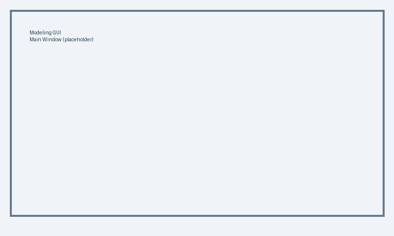
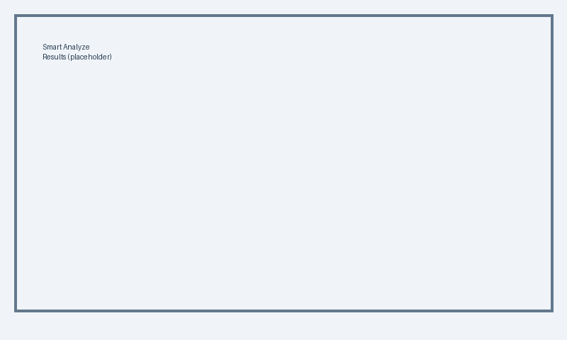
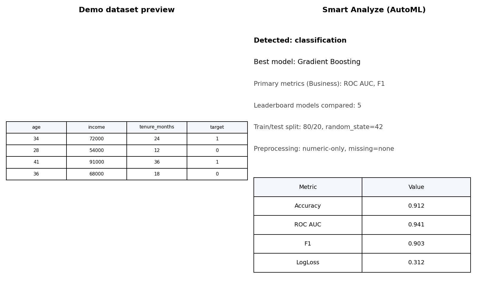
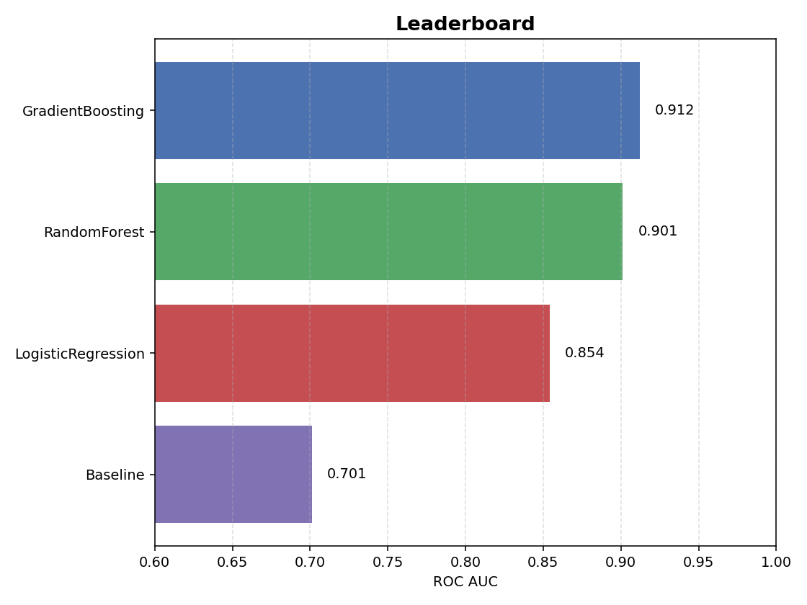
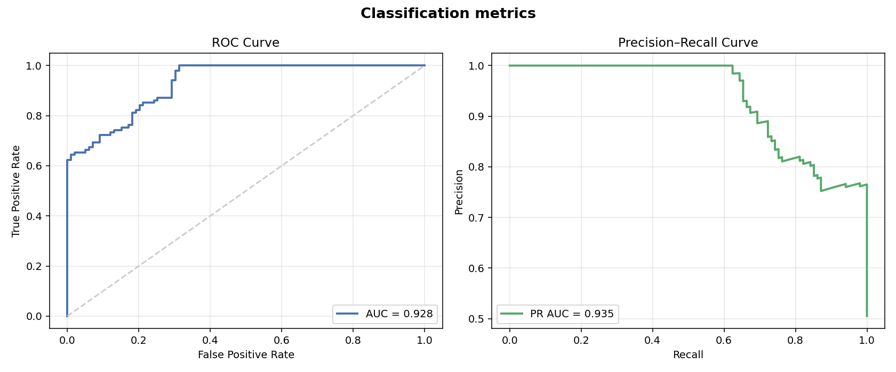
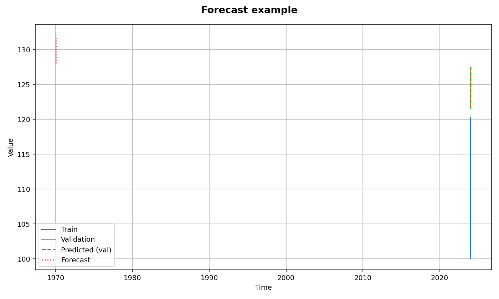
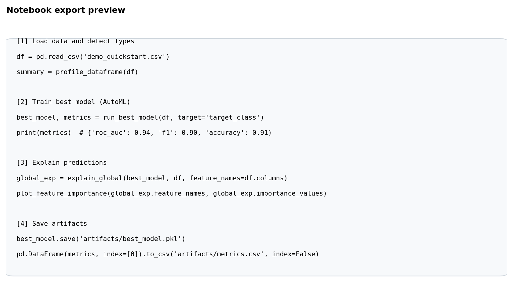

[](https://github.com/chandrasekarnarayana/Modeling-GUI/actions/workflows/ci.yml)
[](https://example.com)

<p align="center">
  
</p>

# Modeling-GUI: No-code ML & stats GUI for CSV data – from beginner to expert

**Modeling-GUI** is a PyQt5 desktop app that lets anyone load a CSV, pick what they want to predict, click **Smart Analyze**, and immediately see metrics, plots, and a transparent **“What I did”** report.  

Non-coders get a guided, one-button experience. Power users keep full control over models, parameters, and preprocessing.

---

## Vision & Philosophy

Most people who work with data are **not** programmers: financial analysts, lab scientists, students, small-business owners, and domain experts of all kinds. They often have:

- A **CSV file**,  
- A **question** (“What drives this?”, “Can I predict that?”),  
- And **very little time** or coding experience.

**Modeling-GUI** aims to be their missing bridge:

- A **tool for “dummies” on the surface**, but backed by solid statistical and ML workflows.
- Minimal choices for beginners (just “What do you want to predict?” and “Run Smart Analyze”).
- Full transparency and control for experts:
  - Inspect preprocessing and model choices,
  - Switch to manual models,  
  - Tweak parameters, and  
  - Reproduce everything later via project files and reports.

The goal is simple:  
> **Lower the barrier to serious modeling while staying honest, explainable, and reproducible.**

---

## Table of Contents

- [Vision & Philosophy](#vision--philosophy)
- [Features](#features)
- [Installation](#installation)
- [Launch](#launch)
- [Quickstart (60 seconds)](#quickstart-60-seconds)
- [Usage](#usage)
  - [Supported Models](#supported-models)
  - [Example Workflow](#example-workflow)
  - [Visualizations](#visualizations)
  - [Train/Test Split & Metrics](#traintest-split--metrics)
  - [Model Persistence](#model-persistence)
  - [Smart Analyze (AutoML)](#smart-analyze-automl)
  - [Basic vs Expert Mode](#basic-vs-expert-mode)
  - [Domain Presets](#domain-presets)
- [Projects & Reports](#projects--reports)
- [Examples](#examples)
- [Dependencies](#dependencies)
- [Screenshots](#screenshots)
- [Demo Video](#demo-video)
- [Version](#version)
- [License](#license)
- [Acknowledgments](#acknowledgments)

---

## Features

- **Smart Analyze**
  - One click to detect the problem type, run AutoML (optional dependency), compute metrics, generate plots, and produce a human-readable **“What I did”** summary.

- **Basic & Expert modes**
  - **Basic:** minimal UI for beginners (load CSV → choose target → Smart Analyze).
  - **Expert:** exposes full model selection, preprocessing options, parameter dialogs, and manual runs.

- **Domain presets**
  - Presets for **Finance**, **Science**, **Business**, and **Generic**:
    - Tailored hints in the coach/status bar.
    - Preferred metrics and default plots per domain.

- **Modeling**
  - **Regression:** OLS, WLS, GLS, Recursive LS, Robust LS (RLM), Rolling LS, RandomForest, GradientBoosting, Gaussian/Exponential curve fits.
  - **Classification:** RandomForest, GradientBoosting.
  - **Clustering:** KMeans.

- **Visualizations**
  - Regression & residual plots, confusion matrices, tree diagrams, feature importance plots, and curve fits (Gaussian/Exponential).

- **Preprocessing**
  - Missing-value strategies.
  - Optional standardization of numeric features.
  - Simple numeric filtering and type handling.

- **Persistence & reproducibility**
  - Save/load trained models (with key metadata).
  - Save/load project files (`.mgui`) capturing data choices, model settings, metrics, and summaries.
  - Export text/Markdown reports of each analysis.

- **Transparency**
  - Dedicated **“What I did”** tab:
    - Data summary,
    - Preprocessing decisions,
    - Models tried,
    - Best model and metrics,
    - Evaluation setup.

---

## Installation

```bash
pip install modeling-gui
```

This default install includes AutoML (FLAML), Prophet forecasting, SHAP explainability, and shortcut helpers (Windows) out of the box for a one-step experience.

Prefer a lighter install (skip heavy optional deps)?
```bash
pip install "modeling-gui[lean]"
```

---

## Launch

```bash
run_modeling_gui
# or
python -m modeling_gui
```

---

## Quickstart (60 seconds)

1. **Install and launch** the app.
2. Click **Load Demo Dataset** (bundled CSV).
3. Choose what you want to predict (target column).
4. Click **Smart Analyze**.
5. Read the metrics and coach-bar hints; open the **“What I did”** tab to see a transparent summary of the pipeline. For a full AutoML walkthrough, see `examples/automl_smart_analyze_quickstart.md`.

You now have a complete modeling pipeline without writing a single line of code.

---

## Usage

### Supported Models

* **Regression**

  * OLS, WLS, GLS
  * Recursive LS, Robust LS (RLM), Rolling LS
  * RandomForestRegressor, GradientBoostingRegressor
  * Gaussian and Exponential curve-fitting

* **Classification**

  * RandomForestClassifier, GradientBoostingClassifier

* **Clustering**

  * KMeans

---

### Example Workflow

1. **Load data**

   * Load your own CSV, or click **Load Demo Dataset**.

2. **Select target**

   * Pick the column you want to predict (the app labels this as “Target column (what you want to predict)”).

3. **(Optional) Adjust features**

   * Optionally select which columns to use as inputs; by default, all non-target columns are considered.

4. **Run analysis**

   * In **Basic** mode, click **Smart Analyze** to:

     * Detect problem type (regression/classification/…),
     * Run AutoML (if installed),
     * Compute metrics and generate plots.
   * In **Expert** mode, you can instead pick a specific model and set parameters.

5. **Inspect results**

   * Check key metrics and plots.
   * Open the **“What I did”** tab to see data summary, preprocessing, models tried, and evaluation configuration.

6. **Save & share**

   * Save a `.mgui` project or export a report to revisit or share results later.

---

### Visualizations

Depending on the task and model, the app can show:

* Scatter and regression plots
* **Residual plots** for regression
* **Confusion matrices** for classification
* **Decision tree diagrams** (where relevant)
* **Feature importance** bar plots (tree-based models)
* **Curve fits** (Gaussian/Exponential) with fitted curves vs data

---

### Train/Test Split & Metrics

* Optional **train/test split**:

  * Configurable test size and random state.
* Regression metrics:

  * R², RMSE, possibly MAE (domain-dependent)
  * Residual plots
* Classification metrics:

  * Accuracy
  * Classification report (precision, recall, F1 per class)
  * Confusion matrix

Domain presets can change which metrics are highlighted first (e.g. RMSE/MAPE for Finance, R² for Science).

---

### Model Persistence

* **Save model**

  * Store a trained model plus minimal metadata (target, features, preprocessing settings).
* **Load model**

  * Reload a saved model to:

    * Inspect its configuration,
    * Make predictions on new compatible data.

All of this integrates with `.mgui` project files for reproducible workflows.

---

### Smart Analyze (AutoML)

* Detects problem type from the target column:

  * Regression vs classification (and others where supported).
* Runs an AutoML backend (e.g. **FLAML**, if installed via `"modeling-gui[automl]"`) to:

  * Handle preprocessing,
  * Try several models,
  * Select the best configuration based on appropriate metrics.
* Generates:

  * Metrics & plots,
  * A structured summary for the **“What I did”** tab,
  * Optional exportable report.

If AutoML dependencies are not installed, **Smart Analyze** gracefully informs the user and suggests how to enable it.

---

### Basic vs Expert Mode

* **Basic mode**

  * Designed for users with **no coding or ML background**.
  * Shows only:

    * Data loading,
    * Target selection,
    * Domain preset,
    * **Smart Analyze** button,
    * Results and **“What I did”** summary.
  * Coach/status bar guides the user step-by-step.

* **Expert mode**

  * Unlocks:

    * Full model list and selection,
    * Parameter dialogs (e.g. RandomForest, GradientBoosting, KMeans),
    * Preprocessing toggles (standardization, missing-value strategy),
    * Manual run buttons per model.

---

### Domain Presets

Choose a **domain** to customize wording and defaults:

* **Generic**

  * Neutral defaults for general tabular tasks.

* **Finance**

  * Hints tuned to forecasting, risk scoring, and KPI modeling.
  * Emphasis on RMSE/MAE/MAPE and time-series-friendly behavior.

* **Science / Lab**

  * Focus on regression, error analysis, and repeatability.
  * Emphasis on R², RMSE, and residual plots.

* **Business / Marketing**

  * Focus on classification & segmentation (churn, propensity, clustering).
  * Emphasis on accuracy, AUC, confusion matrices, and feature importance.

Domain presets influence:

* Coach bar hints,
* Highlighted metrics,
* Default visualizations shown after Smart Analyze.

---

## Projects & Reports

* **Project files (`.mgui`)**

  * Capture:

    * Data path or reference,
    * Domain preset,
    * Target & feature selection,
    * Preprocessing and AutoML settings,
    * Best model and metrics,
    * **“What I did”** structured summary.
  * Opening a project restores the previous session as closely as possible.

* **Reports**

  * Export text/Markdown summaries that include:

    * Data and preprocessing description,
    * Models tried and best model details,
    * Evaluation metrics,
    * Key remarks for non-technical stakeholders.

---

## Examples

* The `examples/README.md` explains the bundled demo dataset:

  * `modeling_gui/data/demo_quickstart.csv`
  * This is the dataset used when clicking **Load Demo Dataset** in the GUI.
  * Columns include a regression target (`target`) and a binary classification target (`target_class`) so you can try both flows immediately.

---

## Dependencies

* **Core**

  * PyQt5
  * matplotlib
  * seaborn
  * pandas
  * statsmodels
  * scikit-learn
  * scipy
  * graphviz
  * numpy

* **Optional AutoML**

  * FLAML (installed via):

    ```bash
    pip install "modeling-gui[automl]"
    ```

---

## Screenshots

> (Paths and filenames are indicative; adjust if your repo uses different ones.)

* Main window:

  

* Smart Analyze results:

  

* Smart Analyze (AutoML run + metrics):

  

* Leaderboard and tuning:

  

* ROC/PR curves:

  

* Forecasting:

  

* Notebook export preview:

  

## Demo Video

- Watch the 60s demo: [docs/assets/demo_promo.mp4](docs/assets/demo_promo.mp4)  
  (Attach this MP4 to the next GitHub release for easy sharing; LinkedIn prefers native uploads.)
- Plan/record the 6–8 minute walkthrough using the storyboard + helper script: see `docs/marketing/demo_storyboard_longform.md` and `docs/scripts/demo_setup.py`. Save the recorded long-form MP4 to `docs/assets/demo_promo.mp4` before publishing the release.

---

## Further Reading

- [User Guide](docs/user-guide.md)
- [Forecasting](docs/forecasting.md)
- [Explainability & Scenario Testing](docs/explainability.md)
- [Quality, Drift, and Model Cards](docs/quality-and-governance.md)
- [Projects, Bundles, and Notebook Export](docs/projects-and-reports.md)
- [Shortcuts and Installation](docs/shortcuts-and-installation.md)

---

## Version

**Current Version**: `v0.1.2`

---

## License

**GPLv3** – see [`LICENSE`](LICENSE) for details.

---

## Acknowledgments

**Primary Author**  
Chandrasekar Subramani Narayana — developer, researcher, and maintainer of Modeling-GUI. Responsible for core algorithms, GUI architecture, documentation, explainability modules, forecasting engine, AutoML integration, and the project roadmap.

**Conceptual Inspiration & User Perspective**  
Arunaachalam Subramani Narayana — acknowledged with deep gratitude for inspiring the creation of a no-code modeling environment. His early insights, focused on the challenges faced by users who do not program regularly, led to the design principles of minimal steps to run models, intuitive workflows, guided analysis, scenario testing for decision-making, and automation over repeated manual coding. This perspective continues to guide Modeling-GUI for users across finance, science, business, applied research, education, and more.

**Community & Open-Source**  
Thanks to the broader Python ecosystem — PyQt, pandas, scikit-learn, statsmodels, matplotlib, seaborn, Prophet, FLAML, SHAP — which makes this tool possible.
