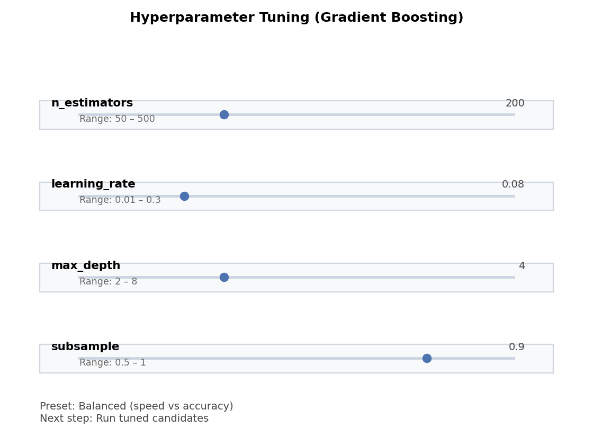

# User Guide

## Modes

- **Basic**: Minimal controls (load CSV, choose target, domain preset, Smart Analyze, results, What I did).
- **Expert**: Full controls for model selection, preprocessing, parameter dialogs, tuning, leaderboard, explainability, scenario testing.

## Smart Analyze (AutoML)

1. Load CSV or demo dataset.
2. Choose target column (what you want to predict) and optional features.
3. Click **Smart Analyze** to auto-detect problem type (regression/classification; time-series when a date column is present) and run AutoML (FLAML + fallbacks) to pick a model.
4. Review **Summary**, **Leaderboard**, **What I did**, **Data quality**, **Explain**, and **Model comparison** tabs.

Details:
- Detection: inspects the target to decide regression vs classification; suggests forecasting when a time column is present.
- Backend: FLAML bundled by default; falls back to built-in models.
- Leaderboard: shows candidate models, metrics, and train times; you can set another model as active.
- Tuning: use **Tune…** (Fast/Balanced/Thorough) for RF/GB models in Expert mode.
- Demo tips: the bundled demo CSV includes both a regression target (`target`) and a binary target (`target_class`) so you can try both flows.
- Walkthrough: `examples/automl_smart_analyze_quickstart.md`.
- Screenshots:
  - 
  - 
  - 

## Domain Presets & Coach Bar

- Domains: Generic, Finance, Science, Business.
- Coach bar provides step guidance and warnings; domain hints adapt phrasing and metric emphasis.
- Troubleshooting: see `docs/troubleshooting.md` for common errors (leakage, imbalance, missing values) and fixes.

## Expert Controls

- Models: OLS/WLS/GLS/RLM/Rolling LS, RandomForest/GradientBoosting (reg/class), KMeans, Gaussian/Exponential fits.
- Preprocessing: missing-value strategy, standardization, numeric filtering, date parsing/derived features (where used).
- Tuning: preset-based hyperparameter search for RF/GBM; leaderboard to pick the best.
- Explain: global/local explanations, feature importance, partial dependence.
- Scenario testing: adjust top feature values and see predicted changes.

## Classical models

- **OLS**: plain linear regression when errors are homoscedastic and independent.
- **WLS**: weighted least squares when you have a weights column (add the weights column to X and pick WLS via Expert mode).
- **GLS**: generalized least squares when you have known correlation/variance structure.
- **RLM**: robust linear model to down-weight outliers.
- **Rolling LS**: moving-window OLS for time-ordered data (no train/test split).
- **KMeans**: unsupervised clustering; set `k` in the KMeans dialog.

Example workflows:
- **Run WLS**: Load CSV → select features + target + weights column in X → Expert mode → choose WLS → Run selected model.
- **KMeans**: Load CSV → select numeric features → Expert mode → choose KMeans → open dialog to set clusters → Run selected model → inspect cluster centers.
- **Gradient Boosting**: For regression or classification, choose **Gradient Boosting** in Expert mode; see `examples/regression_gradient_boosting_basic.md` and `examples/classification_business_roc_pr.md` for step-by-step usage.

### Advanced Linear Regression

- **WLS vs GLS vs RLM vs Recursive/Rolling**: choose WLS for heteroscedastic data with weights; GLS for correlated errors; RLM for outlier robustness; Recursive LS for online-style updates; Rolling LS for time-varying coefficients on ordered data.
- See the worked example: `examples/regression_advanced_ls.md`.

### Advanced Curve Fitting

- **Gaussian**: fits a bell-shaped peak (center/width) for one feature vs target.
- **Exponential**: fits growth/decay curves (rate + baseline).
- Use one feature at a time; select the feature and target, then choose Gaussian/Exponential fitting in Expert mode.
- Example walkthrough: `examples/curve_fitting_gaussian_exponential.md`.

### Clustering

- **KMeans** groups numeric rows into k clusters by minimizing within-cluster variance.
- Works best when features are scaled and clusters are roughly spherical.
- Try several k values (3–5) to see stable segments; centroids summarize each cluster.
- Example walkthrough: `examples/clustering_kmeans_basic.md`.

### Preprocessing & Encoding

- Numeric vs categorical detection is automatic; date columns can be parsed and expanded into year/month/weekday/quarter.
- Categorical encoding (Expert mode):
  - **One-hot** (default, safe).
  - **Target encoding** (advanced, supervised): maps categories to mean target; unseen categories → global mean.
- See `examples/preprocessing_dates_and_categoricals.md` for a walkthrough.

## Metrics & leaderboard

- **Regression metrics**: R², RMSE, MAE, MAPE (finance often highlights RMSE/MAPE; science highlights R²/RMSE).
- **Classification metrics**: accuracy, balanced accuracy, macro/micro F1, ROC AUC (if probabilities), PR AUC (binary).
- **Leaderboard**: Smart Analyze compares candidate models and highlights the best using the primary metric for the current domain. The Model comparison tab lists all runs and can show a metric bar chart; click “Set as active model” to use a different candidate.
- Classification walkthroughs: see `examples/classification_binary_basic.md` (binary), `examples/classification_multiclass_basic.md` (multiclass), and `examples/classification_business_roc_pr.md` (business ROC/PR focus).

Domain → Primary metrics:

| Domain preset | Primary metrics            |
|---------------|----------------------------|
| Generic       | Accuracy, R²               |
| Business      | ROC AUC, PR AUC, F1        |
| Finance       | MAPE, RMSE                 |
| Science       | Balanced accuracy, F1      |

Notes on ROC/PR:
- **ROC AUC**: summarizes true positive vs false positive tradeoff; good overall ranking metric when probabilities are available.
- **PR AUC**: focuses on precision/recall; especially informative on imbalanced classes (e.g., churn/default).
- Business preset emphasizes ROC/PR; see `examples/classification_business_roc_pr.md`.

## Visualizations & saving plots

- Available visuals: regression and residual plots, confusion matrices, tree diagrams, curve fits, feature importance, forecast plots.
- Saving: use **Save plot…** in the main toolbar/results area to export the last shown figure as PNG/PDF.
- Examples:
  - Regression/residuals: `examples/visualizations_regression_and_residuals.md`
  - Confusion/tree: `examples/visualizations_confusion_and_trees.md`
  - Forecast plot notes: `examples/forecasting_basic.md` (forecast plot interpretation)

## Hyperparameter tuning (Expert)

Guided presets for RandomForest/GradientBoosting:
1. Choose model (RF/GB) in Expert mode.
2. Click **Tune…** → pick **fast / balanced / thorough**.
3. Tuning runs RandomizedSearchCV; a popup shows before/after metrics.
4. The tuned model replaces the current estimator and is added to the leaderboard/history.

Tips:
- Use **fast** for quick feedback, **thorough** for better quality on small/medium datasets.
- Ensure X/Y selection is numeric/encoded before tuning.

## Domain recipes

- Domain presets pick defaults and primary metrics for common use-cases.
- See `docs/recipes.md` for ready-made flows:
  - Business: churn classification.
  - Finance: revenue forecasting with ETS/ARIMA.
  - Science: calibration with Gaussian/Exponential fits.
  - Segmentation: KMeans clustering.
